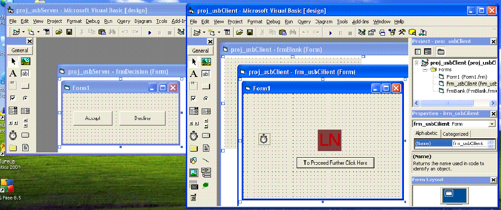



## USB Detect and Inform to Server

### Description

Hello Friends!

Iam a new user of PSC and it is my pleasure to upload my first code into it.It is a simple code with one module and one dll file to detect the unauthorised Usb in an office with the systems are connected with Lan/network.It will be very useful to monitor weather the staff is carrying important data from the office.I thank to one of the programmer from whose code i got the idea to come with this.

One important thing is that to see the best results of this program you need two systems connected in Lan.Any feed back is greatly apriciated.
 
### More Info
 

             |
---                |---
**Submitted On**   |2009-06-23 11:48:38
**By**             |[charan\.p](https://github.com/Planet-Source-Code/PSCIndex/blob/master/ByAuthor/charan-p.md)
**Level**          |Intermediate
**User Rating**    |5.0 (15 globes from 3 users)
**Compatibility**  |VB 6\.0
**Category**       |[VB function enhancement](https://github.com/Planet-Source-Code/PSCIndex/blob/master/ByCategory/vb-function-enhancement__1-25.md)
**World**          |[Visual Basic](https://github.com/Planet-Source-Code/PSCIndex/blob/master/ByWorld/visual-basic.md)
**Archive File**   |[USB\_Detect215634722009\.zip](https://github.com/Planet-Source-Code/charan-p-usb-detect-and-inform-to-server__1-72224/archive/master.zip)

